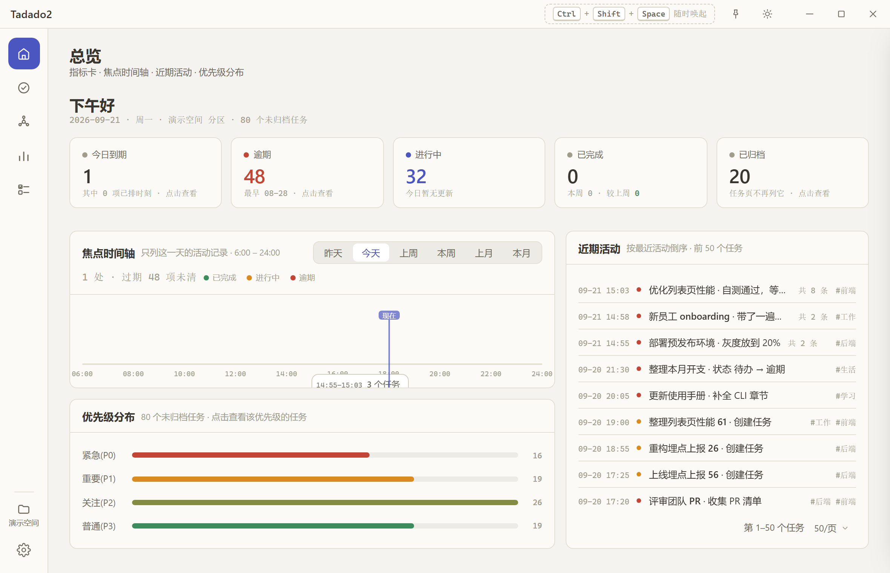
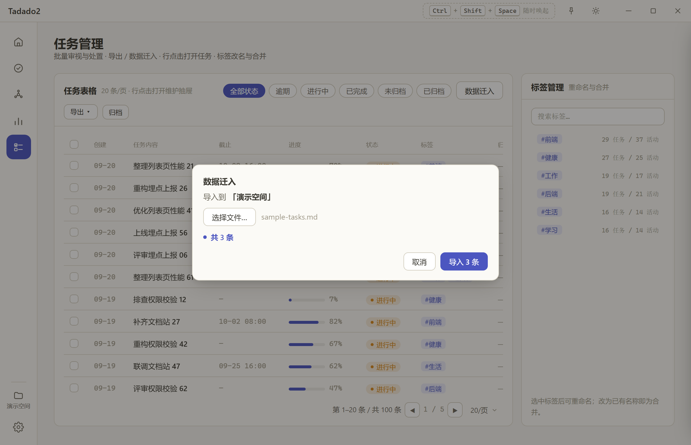
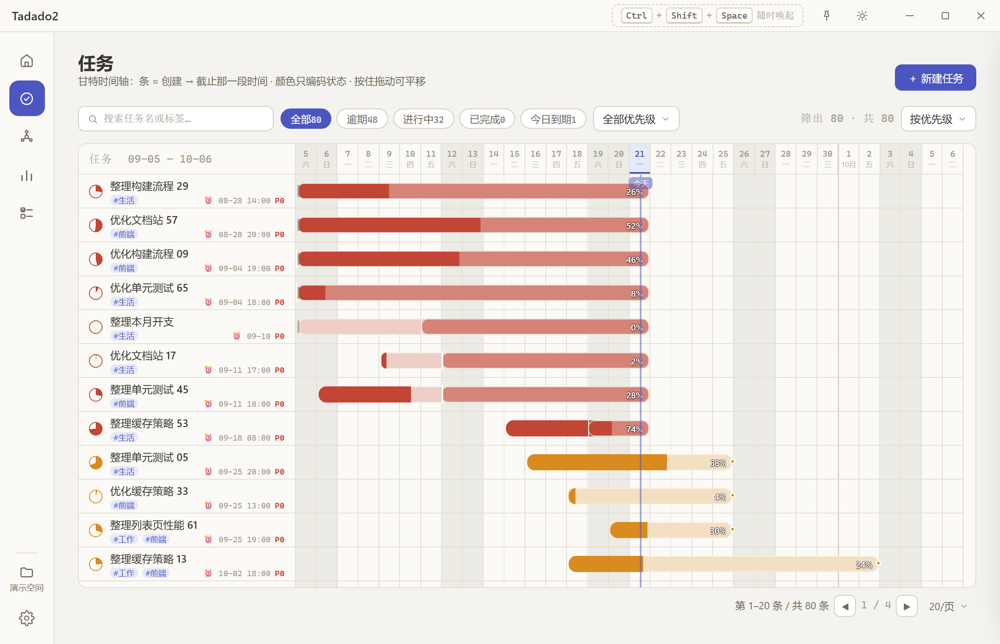
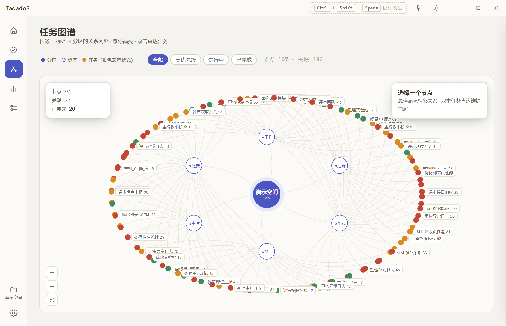
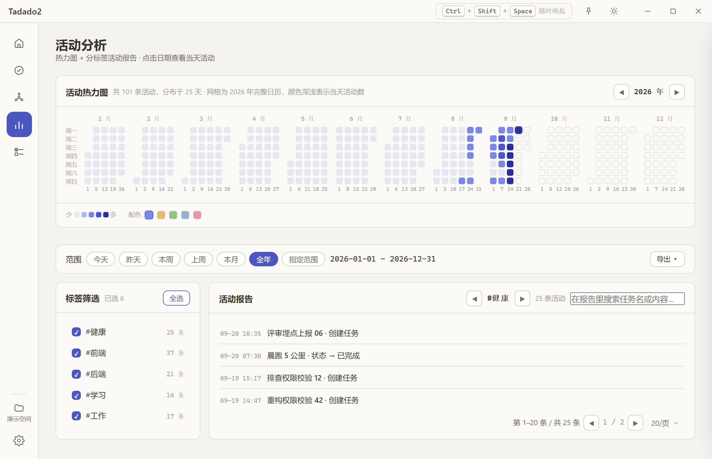
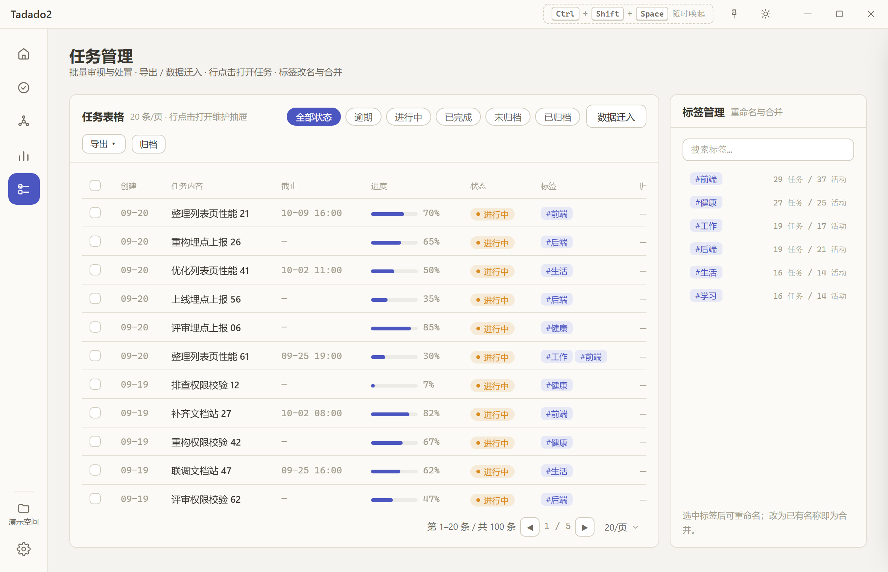
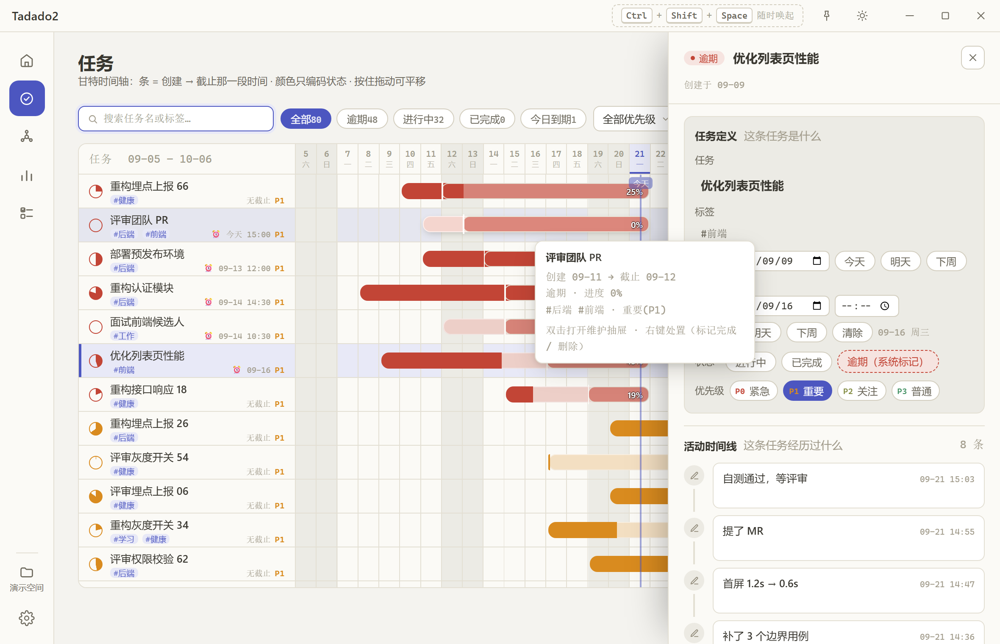
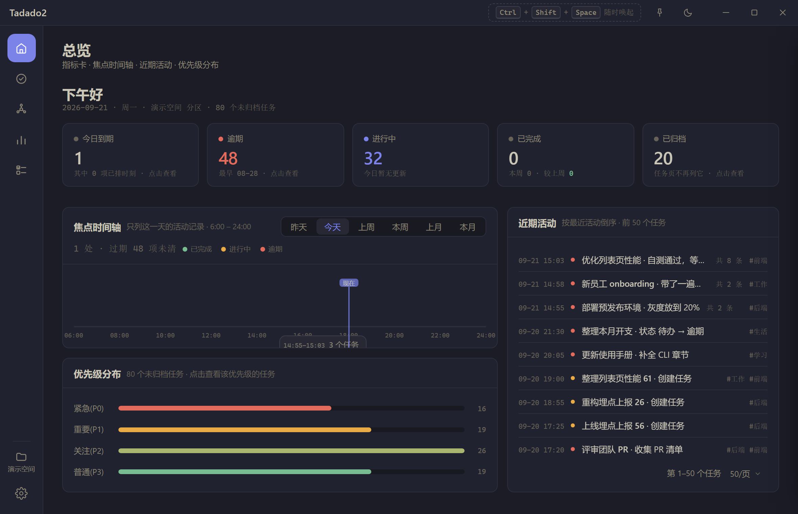

<p align="center">
  
</p>

<h1 align="center">Tadado2</h1>

<p align="center">
  <b>任务是一行字，过程是一条线。</b>
</p>

<p align="center">
  <a href="https://github.com/HananxR/Tadado/releases"></a>
  <a href="LICENSE"></a>
  
  
</p>

<p align="center">
  
</p>

本地优先的桌面任务管理器。任务写成 Markdown 一行，每一次推进都落在它自己的时间线上 ——
所以它回答的不只是「今天该做什么」，还有**「这些天我到底做了什么」**。

数据在本地一个 SQLite 文件里。没有账号、没有云端同步、没有「升级到 Pro」。

## 一行一条任务

```markdown
- [~] 示例任务 #项目 ⏰09-29 14:30 :: 80%
   - 09-25 16:50 记一条进展
```

| 写法 | 读成什么 |
|---|---|
| `[~]` `[x]` | 进行中 / 已完成 |
| `[ ]` | **也认**（老文件、别处导出的清单里都是它）—— 读进来算「进行中」 |
| `#项目` | 标签，一条任务最多三个 |
| `⏰09-29 14:30` | 截止；不写就是「无截止」 |
| `:: 80%` | 进度 |
| 缩进在下面的一行 | **活动**：发生了什么，挂在这条任务的时间线上 |
| 行尾 `+1w` 之类 | 旧版遗留的循环标记。字段已删，解析时仍会吃掉它，不让它粘进标题 |

这不是「导入格式」——**它就是这个软件的数据写法**。任务管理页的**「数据迁入」**读的就是这种
文件：选一个 md，**当场看见解析出几条**、**认不出的行逐条列出来**（不会悄悄少掉）、同名任务
也列出来让你决定跳不跳。迁移旧数据时，它也是唯一能把活动历史一起搬过来的通道。

<p align="center">
  
</p>

## 它不是

- **不是同步服务**：没有账号，数据只在你自己的机器上，也不经过任何服务器
- **不是团队工具**：没有分享、没有协作、没有多人
- **没有手机端**，也**只提供 Windows 构建**
- **不是 Markdown 文件管理器**：任务存 SQLite，Markdown 是你和它之间的写法，不是存放格式

## 五个页面

|  |  |
|:--:|:--:|
| <br>**任务** · 甘特时间轴：色条是创建 → 截止，颜色只编码状态（进度看行首那枚进度饼） | <br>**任务图谱** · 这条任务和什么有关 |
| <br>**活动分析** · 时间花在哪：整年热力图 + 分标签报告 | <br>**任务管理** · 批量处置、标签合并（唯一能看到已归档的视图） |
| <br>**维护抽屉** · 这条任务是什么、它经历过什么 | <br>**暗色主题** · 同一套设计令牌的另一端 |

五个页面都**撑满窗口**：固定的块留在原地，会长的那一块（表格 / 列表）在卡片内部滚。
翻页与筛选时，页头、工具栏、分页器都不会被滚走 —— 目光不用离开手上的操作。

## 数据与隐私

- **数据是你的**：本地一个 SQLite 文件 —— `%APPDATA%\com.tadado.app\tadado.data`。
  想备份、想换机器，**拷这一个文件**就行（页面上的「导出」是给你看的清单，不是备份格式：
  它带不回状态与归档，也恢复不了应用）。
- **它没有联网的能力**。安装包的权限清单里没有授予任何网络权限
  （可以自己核：[`desktop/src-tauri/capabilities/default.json`](desktop/src-tauri/capabilities/default.json)）
  —— 不是「承诺不联网」，是**没给这个能力**。
- **分区**是数据的隔离边界：可以给某个分区单独设口令、空闲几分钟自动重锁。
  但口令**是隐私屏风，不是加密保险箱** —— 它挡的是路过的人瞄一眼，不防能拿到数据文件的人。
  所以忘了口令没有「找回」，直接重设即可。这句话写在设置里，不藏着。
- **单文件、无依赖**：安装包 2.6 MB，不需要 Python、Node 或任何运行库 —— 不是把一个浏览器塞进安装包里。

## 安装

| 方式 | 说明 |
|---|---|
| Windows 安装包 | Releases 下载 `Tadado2_1.0.0_x64-setup.exe`（2.6 MB），双击即装 |
| MSI | `Tadado2_1.0.0_x64_en-US.msi`（3.6 MB），适合静默 / 企业分发 |
| 便携版 | `Tadado2-portable.zip`（3.3 MB），解压即用、放在哪都能跑（WebView2 由 Win10/11 自带） |
| 从源码构建 | `cd desktop && npm install && npm run tauri build` |

首次运行可能弹 SmartScreen 提示 —— 这个安装包**没有买代码签名证书**，与它的内容无关，
选「更多信息 → 仍要运行」即可。装完在开始菜单 / 桌面出现的是 **`Tadado2`** 快捷方式，
安装目录里的主程序也叫 `Tadado2.exe`（`desktop.exe` 只是构建产物在 `target/release/` 下的名字）。

## 升级、重装与卸载

数据**不在安装目录里**（见上面的「数据与隐私」），所以换版本、换位置、换安装方式都不碰它：

| 你要做的事 | 数据会怎样 |
|---|---|
| 覆盖安装 / 升级（同一个位置或换个位置都行） | **原样保留** —— 升级流程里根本不删数据 |
| 卸载 | **默认保留**。卸载界面上那个「删除应用数据」的勾选，是**唯一**会清掉它的开关 |
| 从安装包换成便携版，或者反过来 | **共用同一份数据** —— 两者都按应用标识找 `%APPDATA%\com.tadado.app\` |
| 换一台机器 | 不会自己过去。把 `tadado.data` 这**一个文件**拷过去即可 |

> 装回**旧版本**是可以的（旧程序不会破坏库里的数据），但它不认识新版本加过的字段，
> 下一次保存会把这些字段丢掉。所以「装回去看看」没问题，别在那之后继续录数据。

## 首次打开

第一次运行会看到一批**样例任务**（100 条，全部在「演示空间」分区）—— 它们是给你看清界面
长什么样的，不是你的数据，也不会被同步到任何地方。

想清掉它们：**任务管理页 → 每页条数调到 100 → 勾表头的全选框 → 删除**。
或者在 rail 底部新建一个自己的分区，在那边从零开始。

## 从 v0.x 迁移旧数据

v0.x（PySide6 版）的「活动分析」能导出「标签 → 任务 → 活动」三层清单。仓库里带一个转换工具，
把它重排成能导入的样子，**活动时间线一条不丢**：

> ⚠️ 旧版的数据文件**和这一代同名（都叫 `tadado.data`）但结构不同**，不能按上面那条「拷一个文件」
> 搬过来 —— 走这条路。

```bash
cd resources/skill/tadado-activity-import                # 工具住在 skill 里（可单独拷走）
node scripts/migrate-activity.mjs <活动清单.md>            # 先预演：只对账，不写文件
node scripts/migrate-activity.mjs <活动清单.md> --apply     # 对账通过后生成
```

再到**任务管理页 → 「数据迁入」**：选那个文件，或把生成的文本粘进去。确认「共 N 条」与清单
条数一致后再导入；框下面若列出「N 行没能识别」，说明有行没被读懂 —— 先回去查，别直接导。

带得过来的：标题、标签、状态、进度、**人写的那些活动进展**；创建日与起止按**最早一条活动**
推算（所以是「第一次动手」那天，`start` 也用它，甘特色条不会从导入日才起步）。
带不过来的：「逾期」（由截止日期自动算）、优先级；以及旧版**自动写下**的系统记录（创建 /
延后 / 状态变更 / 进度变更）—— 它们的**结果已经写在任务行上**（状态、进度、截止），
单独留成活动只会把时间线搅浑。

用法、对账口径与导入后的复核步骤见 [`resources/skill/tadado-activity-import/SKILL.md`](resources/skill/tadado-activity-import/SKILL.md)
—— **工具就住在那个 skill 目录里**（`scripts/migrate-activity.mjs`，零依赖，只要机器上有 Node），
所以整个目录单独拷走也能用，不依赖这个仓库。同一份手册也是 Claude Code / Codex 这类助手的
操作指南：它把上面那套「先预演、认不出就停、数字要平」写成了助手**必须遵守**的规矩。

**Releases 里有一份现成的** `tadado-activity-import.zip`（15.6 KB）—— 解压到 `.claude/skills/`
（或 Codex 的对应目录）即可，不需要 clone 这个仓库。

## 版本线

| 版本线 | 形态 | 状态 | 在哪 |
|:--:|---|---|---|
| **v1.x** | **Tadado2** · Tauri 2 | 当前主线，最新 **v1.0.0** | 本目录 `desktop/` |
| v0.x | Tadado · PySide6 | 已归档，最后 v0.2.7 | 分支 [`archive/pyversion`](https://github.com/HananxR/Tadado/tree/archive/pyversion) |

两个版本线**各自维护自己的代码与文档**：切到 `archive/pyversion` 分支，看到的就是那一版
完整的 README、设计文档与源码。两版零数据共享，但共享同一套设计语言（暖灰双主题、
语义色令牌）与同一套领域概念（分区、优先级 P0–P3、状态、活动时间线）。

## 文档

- 详细设计：[DESIGN.md](DESIGN.md)
- 桌面端开发说明：[`desktop/README.md`](desktop/README.md)
- 旧数据迁移工具（兼 AI 手册）：[`resources/skill/tadado-activity-import/SKILL.md`](resources/skill/tadado-activity-import/SKILL.md)
- 发布流程（兼 AI 手册）：[`resources/skill/tadado-release/SKILL.md`](resources/skill/tadado-release/SKILL.md)
- 更新日志：[CHANGELOG.md](CHANGELOG.md)
- 参与贡献：[CONTRIBUTING.md](CONTRIBUTING.md)

## 许可

MIT License © HananxR
