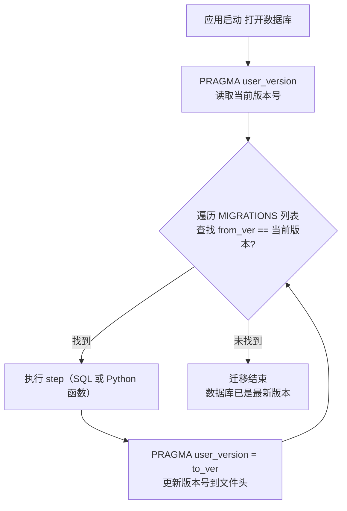
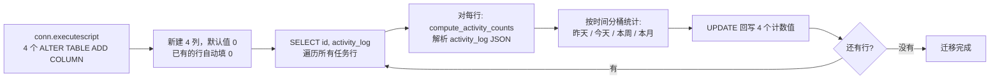
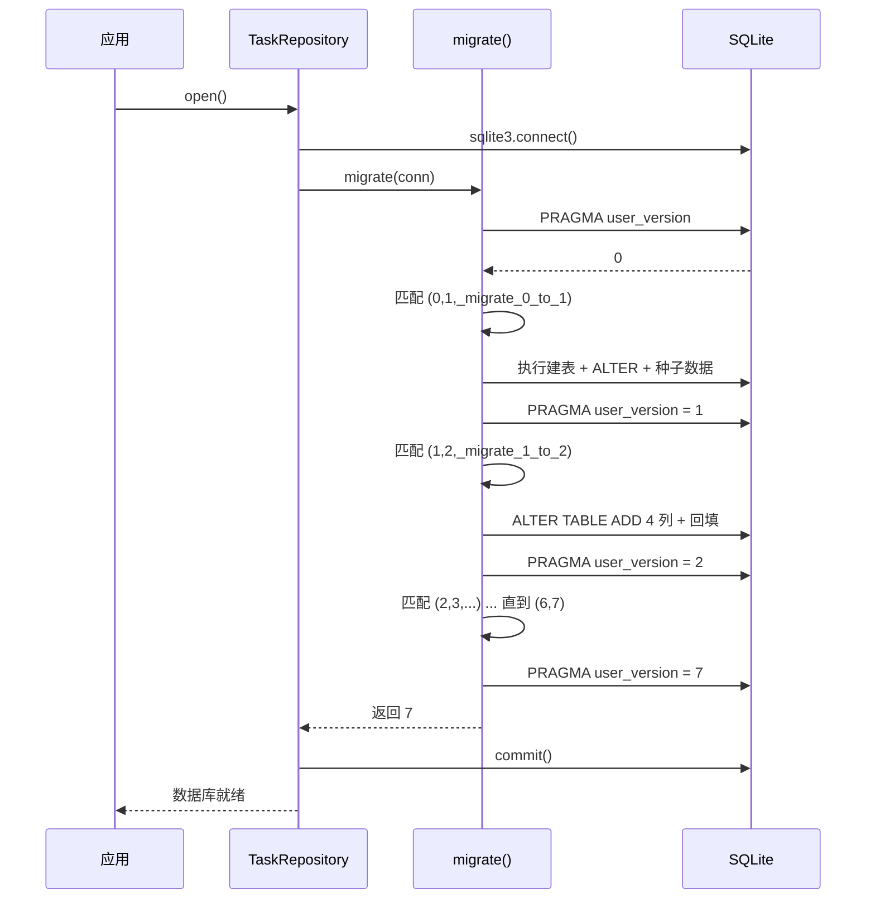

# SQLite 数据库版本迁移：PRAGMA user_version + 线性链方案

## 1. 问题背景

写桌面软件绕不开一件事——发新版时数据库 schema 变了。加了字段、多了表、某个列的数据格式换了。用户机器上跑的是 v0.1 的数据库，你的 v0.2 代码直接访问新字段会报 `no such column`。

不能删库重建（用户数据丢了），也不能让用户自己写 SQL。需要一个**自动检测、自动升级**的机制。

这种需求，Web 后端有 Django Migrations、EF Core Migrations、Alembic 等成熟方案。但桌面应用通常只有一个 SQLite 文件，引一整套 ORM 迁移框架太重了。下面聊一种轻量做法。

## 2. 常见方案对比

| 方案 | 原理 | 适用 | 代价 |
|------|------|------|------|
| Django / EF Core / Alembic | 框架管理迁移文件，记录依赖图（DAG），自动生成升级脚本 | Web 后端、多环境部署 | 绑定框架、依赖重 |
| 手写 SQL 升级脚本 | 发版时附带 `upgrade_v1_to_v2.sql`，用户手动执行 | 有 DBA 的场景 | 无版本追踪，漏执行或重复执行 |
| SQLite `PRAGMA user_version` + 线性链 | 利用 SQLite 文件头自带的整数元数据记录版本，顺序执行迁移函数 | 单机/桌面应用、嵌入式 | 需手写迁移函数，无回滚（向后看缺点一节） |

选哪种方案取决于你的场景。如果项目已经用了 Django，直接用自带的最省事。如果是一个独立的桌面应用，SQLite + 线性链是代价最小的选择。

## 3. 核心原理：`PRAGMA user_version`

SQLite 数据库文件头里预留了一个 32 位整数，叫做 **user_version**（用户版本号）。不是存在哪张表里，是直接写在文件头——建库就有，默认值 0。

读写非常简单：

```sql
-- 读
PRAGMA user_version;        -- 返回 0（新库）或当前版本号

-- 写
PRAGMA user_version = 2;    -- 设置为 2
```

迁移方案就围绕这个值展开：

1. 应用启动，打开数据库
2. `PRAGMA user_version` 读出版本号
3. 去迁移注册表里找 `from_ver == 当前版本` 的条目
4. 找到 → 执行 step → `PRAGMA user_version = to_ver` → 回到步骤 3
5. 找不到 → 说明已是最新，结束

**版本迁移不是靠"文件名"或"配置文件"来追踪的，版本号写在数据库文件内部。** 这意味着你把数据库文件拷到哪，它都自带版本标识。

执行流程：



## 4. 代码拆解（基于 Tadado 项目真实代码）

以 [Tadado](https://github.com) 项目的 `src/models/migrations.py` 为例，完整拆解这套方案。项目当前有 7 个 schema 版本（0→1→2→...→7），这里重点分析 v1 → v2 这一步。

### 4.1 迁移注册表

用 Python list 存放所有迁移步骤，每项是一个 tuple `(from_ver, to_ver, step)`。

```python
# 类型：step 可以是 SQL 字符串或可调用对象
MigrationStep = Union[str, Callable[[sqlite3.Connection], None]]

# 注册表：按版本顺序排列
MIGRATIONS: list[tuple[int, int, MigrationStep]] = [
    (0, 1, _migrate_0_to_1),    # 建表 + 种子数据
    (1, 2, _migrate_1_to_2),    # 加活动统计列 + 回填
    (2, 3, _migrate_2_to_3),    # 重算回填
    (3, 4, _migrate_3_to_4),    # 再加两个统计列
    (4, 5, _migrate_4_to_5),    # 分区提醒/锁列
    (5, 6, _migrate_5_to_6),    # 归档开关列
    (6, 7, _migrate_6_to_7),    # 紧急度列
]
```

**迁移注册表维护在哪里？**

就直接写在 `src/models/migrations.py` 这个 Python 文件里，是一个普通的列表常量。不需要额外的 XML、JSON 配置文件，也不需要一张 `schema_version` 元数据表。加新版本时在这行下面追加一条即可。

设计要点：
- **严格顺序链**。`to_ver` 必须等于下一项的 `from_ver`，不能跳，不能有分支
- **只能加不能改**。只做 `ALTER TABLE ADD COLUMN`，不改已有列的类型、不删列
- 顺序在列表里一眼可见，不需要解析依赖

### 4.2 调度器

`migrate()` 是整个方案的入口，一共 11 行。

```python
def migrate(conn: sqlite3.Connection) -> int:
    """Run pending migrations and return the final schema version."""
    current_version: int = conn.execute("PRAGMA user_version").fetchone()[0]
    for from_ver, to_ver, step in MIGRATIONS:
        if current_version == from_ver:
            if callable(step):
                step(conn)                # Python 函数（可以写复杂逻辑）
            else:
                conn.executescript(step)  # 纯 SQL 字符串
            conn.execute(f"PRAGMA user_version = {to_ver}")
            current_version = to_ver
    return current_version
```

逐行说明：

| 行 | 做了什么 |
|----|----------|
| `PRAGMA user_version` | 读当前版本号。新库返回 0 |
| `for from_ver, to_ver, step` | 按顺序遍历注册表 |
| `if current_version == from_ver` | 只执行匹配当前版本的步骤 |
| `if callable(step)` | 函数 → 传 conn 调用；字符串 → executescript |
| `PRAGMA user_version = to_ver` | 执行成功后立即更新版本号 |
| `current_version = to_ver` | 更新循环变量，继续匹配下一个步骤 |

**关键点**：每执行完一个 step 就立刻写 `PRAGMA user_version`。如果在某个 step 里抛异常，版本号不会更新，下次启动会重试同一个 step。

调用位置在 `TaskRepository.open()` 中，打开数据库后第一件事就是跑迁移。

**从软件视角看，这发生在什么时候？**

```
用户双击 exe → TadadoApp.__init__() → TaskRepository.open() → migrate(conn)
```

应用启动那一刻就会打开数据库，`migrate()` 紧跟在 `sqlite3.connect()` 之后执行。对用户来说，双击图标 → 主窗口出现，迁移在几百毫秒内完成，无感知。如果迁移失败抛异常，应用会终止启动（避免用不匹配的 schema 写脏数据）。

```python
class TaskRepository:
    def open(self) -> None:
        self._conn = sqlite3.connect(self._db_path)
        self._conn.row_factory = sqlite3.Row
        migrate(self._conn)               # <-- 连接后立刻迁移
        self._conn.commit()
```

### 4.3 Step 的两种写法

**纯 DDL —— 用 SQL 字符串**

场景：只加列，不涉及数据转换。

```python
# 注册表里直接写 SQL
(5, 6, "ALTER TABLE tasks ADD COLUMN urgency INTEGER NOT NULL DEFAULT 3")
```

简单直接，适合不需要数据处理的步骤。

**DDL + 数据回填 —— 用 Python 函数**

场景：加列之后要从已有的列数据里解析再写回新列。

这里涉及一个容易误解的地方：`activity_log` 不是磁盘上的 JSON 文件，而是 `tasks` 表里的一个 `TEXT` 列。每条任务在这个列里存一段 JSON 数组，记录用户每次操作的时间戳：

```json
[
  {"ts": "2025-06-15T09:30:00"},
  {"ts": "2025-06-15T14:20:00"},
  {"ts": "2025-06-17T10:00:00"}
]
```

迁移要做的事：给 `tasks` 表新增 4 个整数列（`activity_today` 等），然后遍历所有行，把每行的 `activity_log` JSON 解析、按时间范围分桶统计，写回这 4 个新列。

### 4.4 深入 `_migrate_1_to_2`

这是 v1 → v2 的完整迁移函数，展示了"DDL + 数据清理"组合模式。

```python
def _migrate_1_to_2(conn: sqlite3.Connection) -> None:
    """Add activity count columns for progress bar sorting."""
    # 第一步：加列
    conn.executescript("""
        ALTER TABLE tasks ADD COLUMN activity_yesterday INTEGER NOT NULL DEFAULT 0;
        ALTER TABLE tasks ADD COLUMN activity_today     INTEGER NOT NULL DEFAULT 0;
        ALTER TABLE tasks ADD COLUMN activity_week      INTEGER NOT NULL DEFAULT 0;
        ALTER TABLE tasks ADD COLUMN activity_month     INTEGER NOT NULL DEFAULT 0;
    """)

    # 第二步：从 activity_log JSON 字段回填历史数据
    rows = conn.execute("SELECT id, activity_log FROM tasks").fetchall()
    for row in rows:
        counts = compute_activity_counts(row[1])
        conn.execute(
            "UPDATE tasks SET activity_yesterday=?, activity_today=?, "
            "activity_week=?, activity_month=? WHERE id=?",
            (*counts, row[0]),
        )
```

拆解每一步：



`compute_activity_counts()` 就是这个"数据回填"的辅助函数——解析 `activity_log` JSON 列，按时间范围分桶统计出 6 个计数值，供 UPDATE 写回新列。函数内部怎么分桶与迁库技术无关，不展开。

**为什么要在迁移里做数据回填？** 新建的列 `DEFAULT 0`，如果不回填，之前几周的活动记录就"丢失"了——热力图显示为空白。回填让历史数据对新列可见。

### 4.5 幂等性：让同一迁移跑多次不炸

**先解释一下这个词**：幂等（idempotent）来自数学，指一个操作执行一次和执行多次效果完全一样。数据库迁移里，"幂等"意思是——这个迁移步骤就算因为某种原因被重复执行了，也不会报错或产生错误数据。

什么时候会重复执行？

- **开发期间**：你在测试库上手动 `ALTER TABLE ADD COLUMN` 试了一下，回头迁移函数又跑一遍同一条 ALTER，SQLite 会报 `duplicate column name`。
- **发版回滚后又升级**：用户装了新版（跑了迁移），卸了装回旧版，再装新版——迁移会再次触发。

**处理方式一：try/except 兜底**

```python
# 来自 _migrate_4_to_5
for stmt in [
    "ALTER TABLE partitions ADD COLUMN reminder_interval_minutes INTEGER DEFAULT 60",
    "ALTER TABLE partitions ADD COLUMN quiet_hours_start TEXT DEFAULT '20:00'",
]:
    try:
        conn.execute(stmt)
    except sqlite3.OperationalError:
        pass  # 列已存在，跳过
```

SQLite 的 `ALTER TABLE` 不支持 `IF NOT EXISTS`，只能靠 try/except 吃掉 "列已存在" 的错误。

**处理方式二：数据回填天然幂等**

数据回填部分的逻辑是 SELECT → 计算 → UPDATE 覆盖。比如 `_migrate_1_to_2`：

```python
rows = conn.execute("SELECT id, activity_log FROM tasks").fetchall()
for row in rows:
    counts = compute_activity_counts(row[1])   # 从 JSON 重新统计
    conn.execute("UPDATE tasks SET activity_today=? ... WHERE id=?", ...)
```

跑一次：统计当前 JSON 内容，写入新列。跑两次：重新统计同一个 JSON，覆盖写入同样的值。结果不改，不会出错。

**一句话总结**：纯 DDL（ALTER TABLE）用 try/except 保护，数据回填靠"重新计算 + 覆盖写入"保证安全。

### 4.6 完整执行序列

以新数据库（user_version=0）为例：



老用户从 v1 升级到 v7 的场景：`PRAGMA user_version` 返回 1，跳过 0→1，从 1→2 开始依次跑 1→2、2→3、3→4、4→5、5→6、6→7，共 6 步。新库（user_version=0）则跑满全部 7 步。


**通俗版**：整个过程就像排队过闸机。闸机看一眼你的票（PRAGMA user_version），放你进对应的通道（匹配 from_ver），过完通道后给你换一张新票（更新 user_version），然后拿着新票继续找下一个匹配的通道。最终票号变成 7，所有通道都走完，迁移结束。

## 5. 优缺点

**优点**

| 优点 | 说明 |
|------|------|
| 零外部依赖 | 纯 Python + SQLite 内置功能，不引入任何第三方库 |
| 代码量极少 | 调度器 11 行，注册表 1 个列表。上手和理解成本低 |
| 版本内嵌数据库 | 用户拷走 .db 文件，版本号跟着走，不会出现配置文件不匹配 |
| 用户无感 | 启动时自动执行，老用户什么都不用做 |
| DDL + 数据清洗一步到位 | 同一个 step 里既改 schema 又处理数据，不用分两步 |
| 只向前不向后 | 复杂度低，没有回滚分支需要维护 |

**局限**

| 局限 | 说明 | 缓解 |
|------|------|------|
| 不支持回滚 | 升级后无法自动降回旧版本 | 对于桌面应用，用户通常只需要"新版本能打开旧数据"，不需要降级 |
| 线性链不够灵活 | 多个并行分支（比如同时从 v3 出发有两个变体）无法表达 | 桌面应用版本数少，串行足够 |
| 迁移函数手工维护 | 不像 Django 那样自动生成 | 实际上 Django 的自动生成也需要人工检查 |

**设计时如何规避版本间的内容冲突？**

`user_version` 号本身被占用的问题很好解决（独占、不混用）。真正需要设计经验的是 schema 内容层面的冲突——加重复列、版本号打架、两个开发者同时加了迁移怎么合并。

下面结合本项目踩过的坑，整理几条规则。

**规则一：一个列只在一个迁移里出现**

它看起来像废话，但违反后果严重。假设 v1→v2 加了列 `A`，v3→v4 又写了一句给同一列 `ALTER TABLE ADD COLUMN A`。从 v0 升级的库在 v1→v2 已加成功，到 v3→v4 因为列已存在报 `duplicate column name`。

预防方式：翻一下现有建表语句确认列名不存在再写；或者迁移里 DDL 用 try/except 兜底（但这只是兜底，不应依赖它）。

**规则二：只追加新迁移，不修改已有迁移**

每次加新列都新增一个迁移条目 `(N, N+1, step_N_to_N+1)`，而不是往已有的 `_migrate_0_to_1` 或早期步骤里塞 ALTER 语句。

本项目早期犯过这个规——`_ALTER_COLUMNS` 列表（见 4.1 节）就是一个"缝缝补补"的产物：

```python
# 这些列本应在各自版本新增，却全部塞进了 0→1 里
_ALTER_COLUMNS = [
    "ALTER TABLE tasks ADD COLUMN deadline_time TEXT",
    "ALTER TABLE tasks ADD COLUMN partition_id TEXT ...",
    "ALTER TABLE tasks ADD COLUMN progress INTEGER NOT NULL DEFAULT 0",
    "ALTER TABLE tasks ADD COLUMN suspended INTEGER NOT NULL DEFAULT 0",
    "ALTER TABLE tasks ADD COLUMN urgency INTEGER NOT NULL DEFAULT 3",
    ...
]
```

后果：新库（user_version=0）跑 0→1 时靠 `CREATE TABLE` 一次性建全所有列，而老库靠 try/except 逐条补列。两种路径行为不同，排查问题时很困惑。

正确做法：每个加列需求独立一个 step，不要因为"就一行 ALTER"往旧迁移里塞。

**规则三：多人开发时的版本号冲突**

两人同时从 `main` 切分支加新列，都在 `MIGRATIONS` 末尾挂了 `(6, 7, ...)`。合并后会出现两个步骤抢占同一个 `(6, 7)` 槽位。

解决方式：合并时手动把后合并的那个改成 `(7, 8, ...)`，保持链连续。这不是自动化的问题，线性链的代价就是合并需人工干预——好在桌面应用版本数少、冲突频率低。

**规则四：列定义保持向前兼容**

已经在用的列不改类型、不改约束。如果非改不可，新列换名（如 `deadline_time_v2`），让旧代码跑旧列、新代码跑新列，过渡版本完成后下一个迁移删旧列。但这类操作为数极少，大部分需求只加不删就够了。

## 6. 能否扩展到 MySQL / PostgreSQL？

这套方案的核心不是 `PRAGMA user_version`，而是**"线性链注册表 + 数据库内嵌版本号"**。换到 MySQL、PostgreSQL 上，只需要把版本号的存法换一下。

SQLite 有 `PRAGMA user_version` 这个文件头字段可用。MySQL、PostgreSQL 没有等价物，但可以手动建一张版本表来替代：

```sql
-- MySQL / PostgreSQL 通用做法
CREATE TABLE IF NOT EXISTS _schema_version (
    version INTEGER NOT NULL
);
INSERT INTO _schema_version (version) VALUES (0);  -- 新库初始值
```

对应调整调度器中的读写语句：

```python
# SQLite 版
cur = conn.execute("PRAGMA user_version")
# MySQL 版
cur = conn.execute("SELECT version FROM _schema_version LIMIT 1")
```

其余逻辑完全不变——`MIGRATIONS` 列表、`for` 循环匹配、顺序执行、每步完成更新版本号。

**差异汇总**

| 关注点 | SQLite | MySQL / PostgreSQL |
|--------|--------|--------------------|
| 版本号存在哪 | 文件头 `PRAGMA user_version` | 自建 `_schema_version` 表（一行一列） |
| 连接对象 | `sqlite3.Connection` | `mysql.connector` / `psycopg2` 各自的连接 |
| DDL 语法 | `ALTER TABLE ... ADD COLUMN` 等 | 基本一致，但 `ALTER` 细节有差异 |
| 幂等保护 | `try/except OperationalError` | 同上，或用 `IF NOT EXISTS`（MySQL 8.0+ 部分 DDL 支持） |
| 调度器代码改动量 | 零 | 只改版本号读写 2 行 + 连接类型 |

**一个通用的调度器写法**：把版本号的读写抽象掉。

```python
def _read_version(conn) -> int:
    """SQLite: PRAGMA user_version. MySQL/PG: SELECT version FROM _schema_version."""
    raise NotImplementedError

def _write_version(conn, version: int) -> None:
    """SQLite: PRAGMA user_version = N. MySQL/PG: UPDATE _schema_version SET version = N."""
    raise NotImplementedError

def migrate(conn) -> int:
    current = _read_version(conn)
    for from_v, to_v, step in MIGRATIONS:
        if current == from_v:
            step(conn) if callable(step) else conn.executescript(step)
            _write_version(conn, to_v)
            current = to_v
    return current
```

切换数据库时，把 `_read_version` / `_write_version` 替换成对应实现即可，迁移注册表和调度循环原封不动。本质上，这套方案的通用部分和数据库强相关的部分只有版本号存放位置这一个点。

## 7. 拿走即用的模板

以下是最小可运行版本，复制到你的项目里直接改。

```python
"""db_migrations.py -- 零依赖 SQLite schema 迁移"""
import sqlite3
from typing import Callable, Union

MigrationStep = Union[str, Callable[[sqlite3.Connection], None]]


def migrate(conn: sqlite3.Connection,
            migrations: list[tuple[int, int, MigrationStep]]) -> int:
    """读取当前版本，顺序执行待运行的迁移步骤。"""
    current = conn.execute("PRAGMA user_version").fetchone()[0]
    for from_v, to_v, step in migrations:
        if current == from_v:
            if callable(step):
                step(conn)
            else:
                conn.executescript(step)
            conn.execute(f"PRAGMA user_version = {to_v}")
            current = to_v
    return current


# ===== 在这里定义你的迁移步骤 =====

def step_add_email(conn: sqlite3.Connection) -> None:
    """v1→v2：给 users 表加 email 列并设置默认值"""
    conn.executescript("""
        ALTER TABLE users ADD COLUMN email TEXT NOT NULL DEFAULT '';
    """)
    # 如果已有 username 列，用它生成默认 email
    conn.execute(
        "UPDATE users SET email = username || '@example.com' WHERE email = ''"
    )


# 注册表：按版本顺序排列
MIGRATIONS: list[tuple[int, int, MigrationStep]] = [
    (0, 1, """
        CREATE TABLE IF NOT EXISTS users (
            id INTEGER PRIMARY KEY,
            username TEXT NOT NULL
        );
    """),
    (1, 2, step_add_email),
    # 更多版本...
]


# ===== 使用方式 =====
def get_connection(db_path: str) -> sqlite3.Connection:
    conn = sqlite3.connect(db_path)
    ver = migrate(conn, MIGRATIONS)
    print(f"当前 schema 版本: {ver}")
    return conn
```

修改步骤：
1. 把 `CURRENT_VERSION` 改成你项目当前的 schema 版本号
2. 新增迁移时，在 `MIGRATIONS` 列表末尾追加 `(CUR, CUR+1, step_function)`
3. `step_function` 可以是纯 SQL 字符串，也可以是一个接收 `sqlite3.Connection` 的函数

## 8. 什么时候用它

这套方案适合：

- **桌面应用**（Electron、PySide、WPF 等）—— 每个用户只有一个 SQLite 文件
- **移动端本地数据库** —— 你控制 app 的发布节奏
- **单机工具、脚本** —— 不需要多实例、不需要 CI/CD 跑 migration
- **嵌入式场景** —— 零依赖是硬需求

不适合：

- 多实例共享数据库（需要分布式锁控制迁移执行）
- 有严格回滚要求的场景
- schema 变更频繁且复杂（比如团队多人并行改表结构）—— 这种建议上 Alembic

## 参考

- [SQLite PRAGMA user_version 官方文档](https://www.sqlite.org/pragma.html#pragma_user_version)
- Tadado 项目 `src/models/migrations.py` —— 本文所有代码均来自该项目
