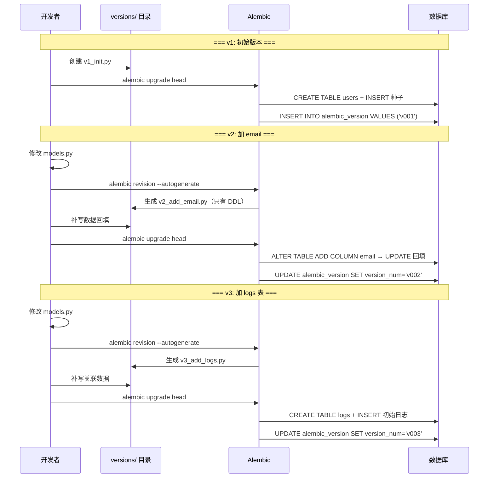

# FastAPI + Alembic 数据库迁移

## 1. 引言

在 Tadado 项目中，我们手动实现了一套 SQLite 数据库版本迁移方案：[SQLite PRAGMA user_version + 线性链](database-migration-technique.md)。核心思路是用 SQLite 文件头自带的 `user_version` 整数追踪版本号，所有迁移步骤排成一个有序列表，启动时顺序执行。

这套方案零依赖、代码量极少，适合单人维护的桌面应用。但换个场景——Web 后端、多人协作、频繁改表——线性链的短板就暴露了：无法并行开发、不支持回滚、DDL（数据定义语言，即建表/加列/加索引等结构变更操作）全靠手写。

FastAPI 是 Python Web 生态中目前使用最广泛的框架之一 [11]，其周边工具链成熟、文档齐全。本文以它为例，探索业界如何标准地解决数据库迁移问题。

FastAPI 生态怎么解决这个问题？答案是 **Alembic**。Alembic 官网定位：

> *"Alembic is a lightweight database migration tool for usage with the SQLAlchemy Database Toolkit for Python."* [1]

它是 SQLAlchemy 团队维护的官方迁移工具，和 SQLAlchemy ORM 深度集成。

## 2. 核心技术：Alembic

掌握 Alembic 只需要理解四件事：

| 概念 | 解决的问题 | 对应小节 |
|------|-----------|----------|
| 工作流 | Alembic 在整个开发流程中扮演什么角色，什么时候用 | 2.1 |
| 版本链 | 多个 schema 版本如何组织、如何追踪当前处于哪个版本 | 2.2 |
| autogenerate | 改完 ORM 模型后，迁移脚本怎么生成 | 2.3 |
| 数据迁移 | 表结构变了，已有数据怎么跟着变 | 2.4 |

四者的关系：工作流是框架，版本链是骨架，autogenerate 生成 DDL，数据迁移手动补 DML。下面逐一展开。

### 2.1 工作流

Alembic 的核心工作流分三个阶段，每一步之间有明确边界 [2][3]：

**阶段一：改 ORM 模型**（不涉及 Alembic）

在 `models.py`（存放 ORM 表定义的文件，每个 Python 类对应数据库中的一张表）中修改 SQLAlchemy ORM 模型——加字段、加表、改约束。改完的 ORM 模型定义了"目标 schema"，但**数据库不会被自动修改**——ORM 模型只是 Python 代码，数据库是独立的文件或服务。

**阶段二：生成迁移脚本**（Alembic CLI）

```bash
alembic revision --autogenerate -m "说明"
```

Alembic 对比 ORM 模型（`Base.metadata`）与数据库实际结构，将差异翻译成 `op.add_column()`、`op.create_table()` 等 Python 操作，写入 `alembic/versions/` 下的新文件。文件名由 Alembic 自动拼接生成：`<revision_hash>_<消息文本用下划线连接>.py`，例如执行 `-m "add email to users"` 会生成 `abc123def456_add_email_to_users.py`。这一步自动处理了 DDL（数据定义语言，即建表、加列、加索引等结构变更），但数据迁移逻辑不会生成，需要在下一步人工补充。

**阶段三：执行迁移**（Alembic CLI / Python API）

```bash
alembic upgrade head
```

Alembic 读取数据库当前版本号 → 在版本链上定位 → 按顺序执行所有待运行的 `upgrade()` → 更新版本号 [6]。执行完后数据库 schema 与 ORM 模型定义一致。

### 2.2 版本链机制

Alembic 不用连续整数做版本号，而是用 12 位 hex hash（如 `abc123def456`）[5]。

为什么不用自增整数？如果两个开发者同时从 v3 出发各自加列，用整数方案两人都会生成 v4——合并时冲突。hash 基于 UUID 生成，不同机器、不同时刻跑出来的值天然不会碰撞。这样每个人可以独立生成迁移文件，最后通过 `alembic merge` 合并分支 [5]。（Alembic 自身版本号采用三位数方案，如 1.8.4，但迁移文件的 revision ID 使用 hash，两者是不同层面的标识。）

每个迁移文件内部声明父子关系：

```python
# alembic/versions/abc123_add_email.py
revision = "abc123def456"        # 当前节点 ID
down_revision = "789xyz000111"   # 父节点 ID（None 表示根节点）
```

`versions/` 目录下所有文件的 `revision` / `down_revision` 关系自动拼成一条链（严格说是一个有向无环图 DAG，单应用场景下退化为链）[5]。

数据库里有一张 `alembic_version` 表，只存当前版本号：

```sql
SELECT * FROM alembic_version;
-- abc123def456
```

Alembic 执行 `upgrade head` 时做的事：读 `alembic_version` 表 → 在链上找到当前位置 → 执行后面所有 `upgrade()` → 更新 `alembic_version` [6]。

### 2.3 自动生成：`--autogenerate`

迁移脚本不是黑盒生成的 SQL 字符串，而是可读的 Python 代码——你可以直接打开 `versions/` 下的文件审阅、修改、补充逻辑 [4]。

`alembic revision --autogenerate` 对比两样东西 [7]：

- `Base.metadata` — ORM 模型定义的"理想"表结构（在 `env.py` 中通过 `target_metadata` 指定）
- 数据库实际结构 — 通过连接直接读取

差异被翻译成 `op.add_column()`、`op.create_table()` 等 Alembic 操作。能自动检测的：加列、加表、加索引、列变 nullable。检测不到的：列重命名（会被识别为"删旧列 + 加新列"，导致数据丢失）、类型隐式转换 [8]。所以社区一致强调：生成后必须人工读一遍再跑。

### 2.4 数据迁移：DDL 不管的事

这是最容易困惑的点。`--autogenerate` **只管 DDL**（表结构变更），**不管 DML**（数据操作语言，即 INSERT/UPDATE/DELETE 等数据变更）[9]。

加列时如果需要回填数据，你必须在 `upgrade()` 里手写 [10]：

```python
def upgrade():
    # DDL（autogenerate 生成的）
    op.add_column("users", sa.Column("email", sa.String(100), nullable=True))

    # DML（手写的 —— autogenerate 不会生成这段）
    conn = op.get_bind()
    rows = conn.execute(sa.text("SELECT id, name FROM users")).mappings().all()
    for row in rows:
        conn.execute(
            sa.text("UPDATE users SET email = :e WHERE id = :i"),
            {"e": f"{row['name']}@example.com", "i": row["id"]},
        )
```

常用数据迁移 API：

| 方法 | 用途 |
|------|------|
| `op.get_bind()` | 拿到当前数据库连接，可执行任意 SQL |
| `op.execute(sql)` | 执行裸 SQL（无返回值） |
| `conn.execute(sa.text(sql), params)` | 带参数执行，可遍历结果 |
| `op.bulk_insert(table, rows)` | 批量插入 |

## 3. 实战案例

配套可运行 Demo：[fastapi-alembic-demo/](fastapi-alembic-demo/)

场景：一个用户管理系统，从零开始经历 3 个版本迭代——建表 → 加 email 列并回填 → 加日志表并迁移关联数据。

> Demo 中版本文件名用了 `v1_init.py`、`v2_add_email.py` 等可读名称，revision ID 也手动设为 `v001`/`v002`/`v003`，而非 Alembic 默认的 12 位 hash。这是为了让读者一眼看清版本顺序。`alembic revision` 默认生成的是 `abc123def456_xxx.py` 这类 hash 前缀文件名，小项目手动改成可读名称完全可行；多人协作时建议保留 hash，避免冲突。

### 3.1 项目结构

在真实 FastAPI 项目中，Alembic 通常和 `app/` 目录同级放置 [11]：

```
your_project/
├── app/
│   ├── __init__.py
│   ├── main.py             # FastAPI 应用入口
│   ├── db.py               # engine、Session、Base 定义
│   └── models.py           # ORM 模型（User、Log 等）
├── alembic/                # ← alembic init alembic 生成
│   ├── env.py              # 迁移环境（关键文件）
│   ├── script.py.mako      # 迁移文件模板
│   └── versions/
│       ├── v1_init.py      # 建 users 表 + 种子数据
│       ├── v2_add_email.py # 加 email 列 + 数据回填 ★
│       └── v3_add_logs.py  # 建 logs 表 + 关联数据迁移
├── alembic.ini             # Alembic 配置文件
└── pyproject.toml
```

> **关于 SQLite**：Demo 使用 SQLite 纯粹为了零配置跑起来——不需要安装数据库服务。实际 FastAPI 项目通常连接 PostgreSQL 或 MySQL，只需把 `sqlalchemy.url` 换成对应的连接字符串即可，Alembic 的使用方式完全不变。SQLite 的少数限制（如不支持 `ALTER COLUMN SET NOT NULL`）在 Demo 中已注明。

两个关键配置文件：

**`alembic.ini`** — Alembic 的主配置，核心是 `script_location` 指向 alembic 目录：

```ini
[alembic]
script_location = alembic       # 迁移脚本目录的路径
sqlalchemy.url = sqlite:///demo.db
```

`script_location` 告诉 Alembic 去哪找 `env.py` 和 `versions/`。命令行必须在此文件所在目录执行。

**`alembic/env.py`** — 迁移运行时环境，最关键的一行 [11]：

```python
from app.models import Base     # 导入 ORM 模型的 Base
target_metadata = Base.metadata # 告诉 alembic 代码里定义的表结构
```

`target_metadata` 是 autogenerate 的"参照物"——Alembic 拿它和数据库实际结构对比。`--autogenerate` 能不能工作，就看这一行指对了没有。

> **为什么是 `Base.metadata` 而不是 `User` 或 `Log`？** `Base` 是 SQLAlchemy 的 `DeclarativeBase`，它内部维护了一个 `MetaData` 注册表。当 Python 执行 `class User(Base)` 时，`users` 表的结构会自动注册到 `Base.metadata` 中；`Log` 同理。所以 `Base.metadata` 里已经装着**所有**继承自 `Base` 的表定义。`env.py` 只导入 `Base` 这一个对象就能拿到全部，不用逐一列出 `User`、`Log`。

初始化命令（在项目根目录执行，只需一次）：

```bash
alembic init alembic
#  ↑        ↑
#  CLI 工具  生成的目录名（可以叫别的，约定俗成叫 alembic）
```

这会生成 `alembic/` 目录和 `alembic.ini`。`alembic.ini` 中的 `script_location = alembic` 就是指向这个目录。

### 3.2 迁移触发方式

有两种方式，做的事完全一样：

**开发时 — 终端手动跑**

```bash
# 改完 models.py 后
alembic revision --autogenerate -m "add email"
# 审核生成的文件，补数据迁移
alembic upgrade head
```

**部署时 — 代码自动跑**

Demo 的 `app/main.py` 启动时通过 Python API 调用 [12]：

```python
from pathlib import Path
from alembic.config import Config
from alembic import command

# alembic.ini 的绝对路径（代码中不能用相对路径，因为执行目录不一定是 demo 根目录）
alembic_cfg = Config(str(Path(__file__).parent.parent / "alembic.ini"))
alembic_cfg.set_main_option("sqlalchemy.url", "sqlite:///demo.db")
command.upgrade(alembic_cfg, "head")
```

> `Path(__file__).parent.parent` 是 `app/` 的上一级即 demo 根目录。用绝对路径避免执行目录不同时找不到配置文件。

生产环境的容器入口脚本通常在 `uvicorn` 之前跑 `alembic upgrade head`。

### 3.3 版本演进

**v1 — 建表 + 种子数据**

首次创建迁移：

```bash
alembic revision -m "init users table"
```

手写 `v1_init.py`：

```python
revision = "v001"
down_revision = None       # 根节点

def upgrade():
    op.create_table("users",
        sa.Column("id", sa.Integer(), primary_key=True),
        sa.Column("name", sa.String(50), nullable=False),
        sa.Column("created_at", sa.String(19), nullable=False),
    )
    # 种子数据
    op.execute("INSERT INTO users (name, created_at) VALUES ('张三', '2025-01-01 10:00:00')")
    op.execute("INSERT INTO users (name, created_at) VALUES ('李四', '2025-01-15 14:30:00')")
    op.execute("INSERT INTO users (name, created_at) VALUES ('王五', '2025-02-20 09:00:00')")
```

执行 `alembic upgrade head` 后数据库状态：

| id | name | created_at | email |
|----|------|------------|-------|
| 1 | 张三 | 2025-01-01 | — |
| 2 | 李四 | 2025-01-15 | — |
| 3 | 王五 | 2025-02-20 | — |

**v2 — 加列 + 数据回填（重点）**

需求：给 users 加 `email` 列（NOT NULL），已有用户的 email 不能为空。

先改 ORM 模型（`models.py` 的 `User` 类加 `email: Mapped[str]`），然后生成迁移：

```bash
alembic revision --autogenerate -m "add email to users"
```

**产物**：`alembic/versions/` 下多出一个 `v2_add_email.py`。Alembic 自动设好了 `revision`（hash ID）和 `down_revision`（指向 v1），`upgrade()` 里自动填入了检测到的 DDL：

```python
# alembic revision --autogenerate 自动生成的文件内容：
revision = "abc123def456"
down_revision = "v001"        # 自动链接到链上的 v1

def upgrade():
    # ★ 以下由 autogenerate 自动生成
    op.add_column("users", sa.Column("email", sa.String(100), nullable=True))
    # ★ autogenerate 到此为止
```

每次 `vx_xxx.py` 的依据是 **ORM 模型与数据库实际结构的 diff**：Alembic 对比 `Base.metadata` 和数据库，发现 `email` 列只存在于前者 → 生成 `op.add_column()` [7]。`down_revision` 自动指向当前数据库的最新版本，链不会断。

**autogenerate 不生成数据迁移**。`op.add_column()` 之后的操作需要手写 [9]。补全后的最终文件：

```python
# 人工补全后的文件（←autogenerate 部分 / ←手写部分）
revision = "abc123def456"
down_revision = "v001"

def upgrade():
    # ---- autogenerate 生成 ----
    op.add_column("users", sa.Column("email", sa.String(100), nullable=True))

    # ---- 人工手写（数据回填）----
    conn = op.get_bind()
    rows = conn.execute(sa.text("SELECT id, name FROM users")).mappings().all()
    for row in rows:
        conn.execute(
            sa.text("UPDATE users SET email = :e WHERE id = :i"),
            {"e": f"{row['name']}@example.com", "i": row["id"]},
        )

    # ---- 加 NOT NULL（SQLite 不支持，PostgreSQL/MySQL 执行此步）----
    # op.alter_column("users", "email", nullable=False)
```

前后对比一目了然：`--autogenerate` 省掉的是手写 `revision`/`down_revision` 和 `op.add_column()` 的机械劳动；但数据回填必须人来写。

> 分三小步的原因：如果直接 `op.add_column(nullable=False)`，老数据行上 email 值是 NULL，数据库拒绝。正确顺序：先 nullable 加 → 填数据 → 加约束 [13]。

执行 `alembic upgrade head` 后：

| id | name | created_at | email |
|----|------|------------|-------|
| 1 | 张三 | 2025-01-01 | 张三@example.com |
| 2 | 李四 | 2025-01-15 | 李四@example.com |
| 3 | 王五 | 2025-02-20 | 王五@example.com |

**v3 — 建新表 + 关联数据**

在 `models.py` 加 `Log` ORM 模型后：

```bash
alembic revision --autogenerate -m "add logs table"
```

自动生成只有 `op.create_table("logs", ...)`，人工补写关联数据迁移：

```python
revision = "v003"
down_revision = "v002"

def upgrade():
    op.create_table("logs", ...)
    # 手写：为已有用户生成初始日志
    conn = op.get_bind()
    users = conn.execute(sa.text("SELECT id, name, created_at FROM users")).mappings().all()
    for u in users:
        conn.execute(
            sa.text("INSERT INTO logs (user_id, action, detail) VALUES (:uid, 'account_created', :d)"),
            {"uid": u["id"], "d": f"用户 {u['name']} 于 {u['created_at']} 注册"},
        )
```

### 3.4 版本演进时序



### 3.5 运行 Demo

```bash
cd docs/fastapi-alembic-demo
uv run uvicorn app:app --port 8000
# 访问 http://127.0.0.1:8000/      查看 users 表
# 访问 http://127.0.0.1:8000/logs   查看 logs 表
# 访问 http://127.0.0.1:8000/version 查看当前迁移版本
```

## 4. 对比与总结

### 4.1 Alembic vs Tadado 线性链

| | Alembic | Tadado 线性链 |
|---|---|---|
| 版本存储 | `alembic_version` 表 | SQLite 文件头 `PRAGMA user_version` |
| 版本标识 | 12 位 hex hash | 连续整数 |
| 链结构 | DAG（`down_revision` 链接） | 线性列表 `[(0,1,...),(1,2,...)]` |
| DDL 生成 | `--autogenerate` 自动 | 全部手写 |
| 数据迁移 | 手写在 `upgrade()` 里 | 手写在 step 函数里 |
| 回滚 | `downgrade()` 支持 | 不支持 |
| 依赖 | SQLAlchemy + Alembic | 零 |
| 适用 | Web 后端、团队协作 | 桌面应用、单人维护 |

本质相同：版本号追踪 + 步骤链 + 顺序执行。Alembic 多了自动生成和回滚，代价是两个依赖。

### 4.2 常用命令速查

| 命令 | 用途 |
|------|------|
| `alembic init alembic` | 初始化 `alembic/` 目录（一次性） |
| `alembic revision --autogenerate -m "说明"` | 改完 ORM 模型后执行，自动生成迁移脚本 |
| `alembic revision -m "说明"` | 生成空迁移骨架（不自动检测） |
| `alembic upgrade head` | 执行所有未跑过的迁移 |
| `alembic downgrade -1` | 回退最近一次迁移 |
| `alembic current` | 查看数据库当前版本 |
| `alembic history` | 查看完整版本链 |

### 4.3 怎么选

- **桌面应用、单文件数据库、不想引依赖** → 线性链，`PRAGMA user_version` 三行代码搞定
- **Web 后端、多人协作、需要自动生成 DDL** → Alembic，社区成熟方案

## 参考文献

| 编号 | 链接 | 说明 |
|------|------|------|
| [1] | https://alembic.sqlalchemy.org/ | Alembic 官方文档首页 |
| [2] | https://alembic.sqlalchemy.org/en/latest/tutorial.html | 官方教程：创建与运行迁移 |
| [3] | https://alembic.sqlalchemy.org/en/latest/autogenerate.html | 自动生成机制详解 |
| [4] | https://alembic.sqlalchemy.org/en/latest/ops.html | Operation 参考（op.add_column 等） |
| [5] | https://alembic.sqlalchemy.org/en/latest/branches.html | 分支与多头部管理（DAG） |
| [6] | https://alembic.sqlalchemy.org/en/latest/tutorial.html#running-our-first-migration | upgrade/downgrade 执行原理 |
| [7] | https://alembic.sqlalchemy.org/en/latest/autogenerate.html#what-does-autogenerate-detect | autogenerate 能检测什么、不能检测什么 |
| [8] | https://alembic.sqlalchemy.org/en/latest/autogenerate.html#what-does-autogenerate-not-detect | autogenerate 的局限 |
| [9] | https://alembic.sqlalchemy.org/en/latest/cookbook.html#data-migration | Cookbook：数据迁移模式 |
| [10] | https://alembic.sqlalchemy.org/en/latest/ops.html#alembic.operations.Operations.get_bind | `op.get_bind()` API 文档 |
| [11] | https://fastapi.tiangolo.com/tutorial/sql-databases/ | FastAPI 官方 SQL 数据库教程 |
| [12] | https://alembic.sqlalchemy.org/en/latest/api/commands.html | Alembic 命令 API（Python 调用方式） |
| [13] | https://www.sqlite.org/lang_altertable.html | SQLite ALTER TABLE 限制说明 |
